original doc:
```
https://medium.com/@vajrapusri08/deploying-agic-and-aks-with-terraform-via-azure-pipelines-helm-based-greenfield-%EF%B8%8F-%EF%B8%8F-f909fc3c305c
```
video links:

Part-1
```
https://www.youtube.com/watch?v=BXYW7pPI1HI
```
Part-2
```
https://www.youtube.com/watch?v=hTBTVkkqRYE
```

Azure Kubernetes Service (AKS) paired with Application Gateway Ingress Controller (AGIC) is a modern approach to managing ingress traffic securely, salable, and efficiently. In this blog, we’ll dive deep into the different AGIC deployment modes and focus on the Greenfield Helm-based deployment using Terraform — a powerful combination for cloud-native infrastructure builders.

🔍 AGIC Deployment Types
Azure supports four primary deployment types for AGIC:

AKS Add-On Greenfield Deployment: Instructions on installing AGIC add-on, AKS, and Application Gateway on blank-slate infrastructure.
AKS Add-On Brownfield Deployment: Install AGIC add-on on an AKS cluster with an existing Application Gateway.
Helm Greenfield Deployment: Install AGIC through Helm, new AKS cluster, and new Application Gateway on blank-slate infrastructure.
Helm Brownfield Deployment: Deploy AGIC through Helm on an existing AKS cluster and Application Gateway.

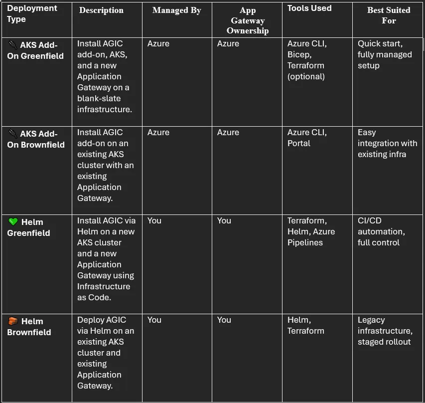

💚 Greenfield Helm Deployment with Terraform + Azure Pipelines — Deep Dive (Using Service Principal)
In a Greenfield scenario, we build everything from the ground up — the Application Gateway, the AKS cluster, the role assignments, and AGIC itself. In this guide, the AKS cluster is configured using a Service Principal (not Managed Identity), which is explicitly passed to AGIC to authenticate with Azure. Using Terraform in Azure Pipelines adds automation and consistency to this infrastructure-as-code strategy.

🏗️ Architecture Components
Here’s a high-level view of what we’re setting up:

🚫 AKS Cluster (Azure Kubernetes Service)
⚖️ Azure Application Gateway (AppGW)
🚀 AGIC via Helm connected to AppGW
🔁 Terraform via Azure Pipelines for automated provisioning
🏗️ Architecture Diagram

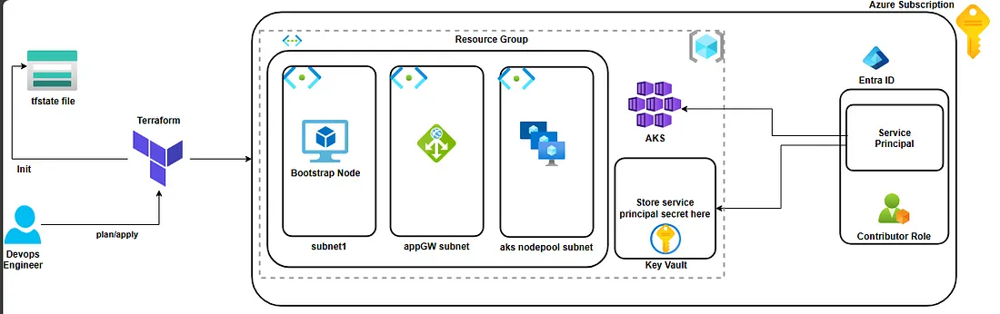

📅 Use Cases for Greenfield Helm Deployment via Azure Pipelines
🚀 Enterprise-grade CI/CD workflows
🛡️ Custom WAF and NSG integration
🌟 Full automation of AKS + App Gateway infrastructure
🧪 Test environments with ephemeral clusters
🌐 Traffic Flow
User hits the Public IP of Application Gateway
AppGW forwards the request based on path rules
AGIC listens to Kubernetes Ingress objects and configures AppGW accordingly
AppGW routes to backend pods via AGIC-defined rules
📦 Modular Terraform Design (Used in This Project)
This project follows a module-based Terraform structure to keep the code clean, reusable, and production-ready.

🔧 Module Breakdown

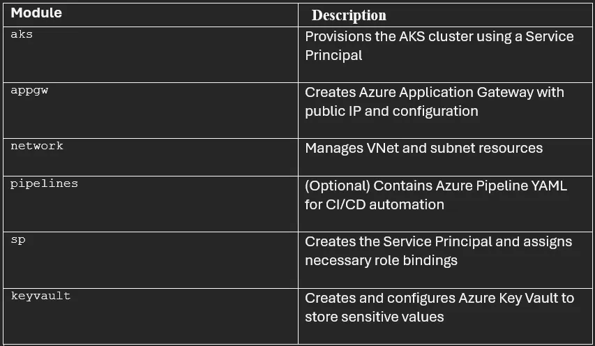

The root module ties all these modules together and passes values between them using outputs and variables. This makes the stack highly modular and easy to scale.

🔐 Service Principal Module
This module provisions a service principal using the AzureAD provider:

main.tf
```
data "azuread_client_config" "current" {}

resource "azuread_application" "main" {
  
  display_name = var.service_principal_name
  owners       = [data.azuread_client_config.current.object_id]
}

resource "azuread_service_principal" "main" {
  client_id                    = azuread_application.main.client_id
  app_role_assignment_required = true
  owners                       = [data.azuread_client_config.current.object_id]
}

resource "azuread_service_principal_password" "main" {
  service_principal_id = azuread_service_principal.main.id
}
```

output.tf
```
output "service_principal_name" {
  description = "The object id of service principal. Can be used to assign roles to user."
  value       = azuread_service_principal.main.display_name
}

output "service_principal_object_id" {
  description = "The object id of service principal. Can be used to assign roles to user."
  value       = azuread_service_principal.main.object_id
}

output "service_principal_tenant_id" {
  value = azuread_service_principal.main.application_tenant_id
}

output "client_id" {
  description = "The application id of AzureAD application created."
  value       = azuread_application.main.client_id
}

output "client_secret" {
  description = "Password for service principal."
  value       = azuread_service_principal_password.main.value
}
```

This module provides outputs that can be securely passed to the AGIC Helm release using armAuth.secretJSON

🔑 Key Vault Module
This module creates a Key Vault to store sensitive values like the Service Principal’s client secret securely.

main.tf
```
data "azurerm_client_config" "current" {}

resource "azurerm_key_vault" "kv" {
  name                        = var.keyvault_name
  location                    = var.location
  resource_group_name         = var.resource_group_name 
  enabled_for_disk_encryption = true
  tenant_id                   = data.azurerm_client_config.current.tenant_id
  soft_delete_retention_days  = 7
  purge_protection_enabled    = false
  sku_name                    = "standard"
  enable_rbac_authorization   = true
}
```
output.tf
```
output "keyvault_id" {
  description = "The ID of the keyvault"
  value       = azurerm_key_vault.kv.id
}
```
Once the client secret is generated from the Service Principal module, it is stored securely as a secret inside this Key Vault using another azurerm_key_vault_secret resource.

🕸️ Virtual Network (VNet) Module
This module provisions a virtual network and one or more subnets for AKS, AGIC, and App Gateway communication.

main.tf
```
resource "azurerm_virtual_network" "aks_vnet" {
  name                = var.vnet_name
  location            = var.location
  resource_group_name = var.resource_group_name
  address_space       = var.virtual_network_address_prefix

  tags = {
    environment = "Production"
  }
}

resource "azurerm_subnet" "aks_subnet1" {
  count                = length(var.aks_subnet_names)
  name                 = var.aks_subnet_names[count.index]
  resource_group_name  = var.resource_group_name
  virtual_network_name = azurerm_virtual_network.aks_vnet.name
  address_prefixes     = [var.aks_subnets_cidr[count.index]]
}
```
output.tf
```
output "vnet_id" {
  value = azurerm_virtual_network.aks_vnet.id
}

output "subnet_ids" {
  value = azurerm_subnet.aks_subnet1[*].id
}
```
The VNet module is reusable and flexible, allowing you to define multiple subnets for different components (AKS, App Gateway, Bastion, etc.).

But here I am using three subnets. one is for VM, it is used to connect to AKS cluster and second subnet is for AppGW and third subnet is for node group.

☸️ AKS Module
This module provisions the AKS cluster with features like autoscaling, role-based access control, Azure network integration, and service principal authentication.

main.tf
```
data "azurerm_kubernetes_service_versions" "current" {
  location        = var.location
  include_preview = false
}

resource "azurerm_kubernetes_cluster" "aks_cluster" {
  name                = var.aks_name
  location            = var.location
  resource_group_name = var.resource_group_name
  dns_prefix          = "${var.resource_group_name}-cluster"
  private_cluster_enabled = false
  role_based_access_control_enabled = true
  kubernetes_version  = local.selected_kubernetes_version
  sku_tier = "Free"
  automatic_upgrade_channel = "patch"

  default_node_pool {
    name       = var.node_pool_name
    vm_size    = "Standard_DS2_v2"
    auto_scaling_enabled = true
    min_count = 1
    max_count = 3
    os_disk_size_gb = 40
    max_pods = 100
    type  = "VirtualMachineScaleSets"
    zones = [1, 2, 3]
    vnet_subnet_id  = var.nodepoolsubnet
    node_labels = {
        "nodepool-type"    = "system"
        "environment"      = "prod"
        "nodepools"       = "linux"
    }
    tags = {
        "nodepool-type"    = "system"
        "environment"      = "prod"
        "nodepools"       = "linux"
    }
  }

  service_principal {
    client_id     = var.client_id
    client_secret = var.client_secret
  }

  network_profile {
    network_plugin     = "azure"
    load_balancer_sku  = "standard"
  }

  linux_profile {
    admin_username = "ubuntu"
    ssh_key {
      key_data = tls_private_key.rsa-4096-example.public_key_openssh
    }
  }
}

resource "tls_private_key" "rsa-4096-example" {
  algorithm = "RSA"
  rsa_bits  = 4096
}
```
output.tf
```
output "kube_config" {
  value = {
    host                   = azurerm_kubernetes_cluster.aks_cluster.kube_config[0].host
    client_certificate     = azurerm_kubernetes_cluster.aks_cluster.kube_config[0].client_certificate
    client_key             = azurerm_kubernetes_cluster.aks_cluster.kube_config[0].client_key
    cluster_ca_certificate = azurerm_kubernetes_cluster.aks_cluster.kube_config[0].cluster_ca_certificate
  }
}

output "kube_config1" {
  value = azurerm_kubernetes_cluster.aks_cluster.kube_config_raw
}

output "client_certificate" {
  value     = azurerm_kubernetes_cluster.aks_cluster.kube_config[0].client_certificate
  sensitive = true
}

output "ssh_private_key" {
  value     = tls_private_key.rsa-4096-example.private_key_openssh
  sensitive = true
}

output "aks_id" {
  value = azurerm_kubernetes_cluster.aks_cluster.id
}
```
local.tf
```
locals{
  selected_kubernetes_version = var.kubernetes_version == "" ? data.azurerm_kubernetes_service_versions.current.latest_version : var.kubernetes_version
}
```
This module configures AKS with autoscaling, zones, and full integration into your VNet and AGIC setup.

🌐 Application Gateway (AppGW) Module
This module provisions the Azure Application Gateway with a public IP and configures frontend and backend settings.

main.tf
```
resource "azurerm_public_ip" "pip" {
  name                = "appgw-pip"
  resource_group_name = var.resource_group_name
  location            = var.location
  allocation_method   = "Static"
  sku                 = "Standard"
  zones               = [1, 2, 3]

  tags = {
    environment = "Production"
  }
}

resource "azurerm_application_gateway" "appgw" {
  name                = "applicationGateway"
  resource_group_name = var.resource_group_name
  location            = var.location
  enable_http2        = false
  zones               = [1, 2, 3]

  sku {
    name     = "Standard_v2"
    tier     = "Standard_v2"
    capacity = 1
  }

  gateway_ip_configuration {
    name      = "appGatewayIpConfig"
    subnet_id = var.appgw_subnet_id
  }

  frontend_port {
    name = local.frontend_port_name
    port = 80
  }

  frontend_ip_configuration {
    name                 = local.frontend_ip_configuration_name
    public_ip_address_id = azurerm_public_ip.pip.id
  }

  backend_address_pool {
    name = local.backend_address_pool_name
  }

  backend_http_settings {
    name                  = local.http_setting_name
    cookie_based_affinity = "Disabled"
    port                  = 80
    protocol              = "Http"
    request_timeout       = 20
  }

  http_listener {
    name                           = local.listener_name
    frontend_ip_configuration_name = local.frontend_ip_configuration_name
    frontend_port_name             = local.frontend_port_name
    protocol                       = "Http"
  }

  request_routing_rule {
    name                       = local.request_routing_rule_name
    priority                   = "100"
    rule_type                  = "Basic"
    http_listener_name         = local.listener_name
    backend_address_pool_name  = local.backend_address_pool_name
    backend_http_settings_name = local.http_setting_name
  }

  lifecycle {
    ignore_changes = [
      tags,
      backend_address_pool,
      backend_http_settings,
      http_listener,
      probe,
      request_routing_rule,
    ]
  }
}
```
output.tf
```
output "appgw_id" {
  value = azurerm_application_gateway.appgw.id
}

output "appgw_name" {
  value = azurerm_application_gateway.appgw.name
}
```
local.tf
```
locals {
  backend_address_pool_name      = "${var.vnet_name}-beap"
  frontend_port_name             = "${var.vnet_name}-feport"
  frontend_ip_configuration_name = "${var.vnet_name}-feip"
  http_setting_name              = "${var.vnet_name}-be-htst"
  listener_name                  = "${var.vnet_name}-httplstn"
  request_routing_rule_name      = "${var.vnet_name}-rqrt"
  redirect_configuration_name    = "${var.vnet_name}-rdrcfg"
}
```
This AppGW module lays the foundation for AGIC integration and supports public access, routing rules, and listener configurations.

Now that all the modules are documented, you can begin the “actual implementation” section in your blog. Here’s what you should add next:

🚀 Root Module: Putting It All Together
Now that we’ve defined our reusable Terraform modules, it’s time to see how they come together in the root implementation. In this section, we use Terraform to call each module, pass the necessary variables, and orchestrate the complete AKS + AGIC infrastructure.

🧩 Root Module Implementation
Now that all the modules are in place, the root module glues everything together. Here’s how the provider.tf, backend.tf, and main.tf are structured:

🌍 provider.tf
```
terraform {
  required_providers {
    azurerm = {
      source  = "hashicorp/azurerm"
      version = "4.23.0"
    }
    azuread = {
      source  = "hashicorp/azuread"
      version = "3.1.0"
    }
    kubernetes = {
      source  = "hashicorp/kubernetes"
      version = "2.36.0"
    }
    helm = {
      source  = "hashicorp/helm"
      version = "3.0.0-pre2"
    }
  }
  required_version = ">=1.9.0"
}

provider "azurerm" {
  subscription_id = var.SUB_ID
  features {
    key_vault {
      purge_soft_delete_on_destroy = false
    }
  }
}

provider "azuread" {}

provider "kubernetes" {
  host                   = module.aks.kube_config.0.host
  cluster_ca_certificate = base64decode(module.aks.kube_config.0.cluster_ca_certificate)
  client_key             = base64decode(module.aks.kube_config.0.client_key)
  client_certificate     = base64decode(module.aks.kube_config.0.client_certificate)
  token                  = module.aks.kube_config.0.token
}

provider "helm" {
  kubernetes = {
    host                   = module.aks.kube_config.host
    client_certificate     = base64decode(module.aks.kube_config.client_certificate)
    client_key             = base64decode(module.aks.kube_config.client_key)
    cluster_ca_certificate = base64decode(module.aks.kube_config.cluster_ca_certificate)
  }
}
```
🗂️ backend.tf
```
terraform {
  backend "azurerm" {
    resource_group_name  = var.rgname
    storage_account_name = var.storage_account_name
    container_name       = var.container_name
    key                  = var.key_name
  }
}
```
This configuration stores the Terraform state file in an Azure Blob Storage container.

To properly set up Terraform with Azure Blob Storage for state file storage, you would need to ensure the following steps are taken:

Create a new storage account or use an existing one.
Create a container within the storage account.
Give anonymous access to the container (although for security reasons, it’s usually recommended to use more secure access methods like SAS tokens or Azure AD authentication instead of anonymous access).

📜 Start with main.tf
In this file, you’ll use the module block to invoke each module and wire their inputs/outputs.

🧵 main.tf
```
resource "azurerm_resource_group" "rg1" {
  name     = var.rgname
  location = var.location
}

module "service_principal" {
  source                 = "./modules/ServicePrincipal"
  service_principal_name = var.service_principal_name
  depends_on             = [azurerm_resource_group.rg1]
}

resource "azurerm_role_assignment" "rolespn" {
  scope                = "/subscriptions/${var.SUB_ID}"
  role_definition_name = "Contributor"
  principal_id         = module.service_principal.service_principal_object_id
  depends_on           = [module.service_principal]
}

module "keyvault" {
  source                      = "./modules/Keyvault"
  keyvault_name               = var.keyvault_name
  location                    = var.location
  resource_group_name         = var.rgname
  service_principal_name      = var.service_principal_name
  service_principal_object_id = module.service_principal.service_principal_object_id
  service_principal_tenant_id = module.service_principal.service_principal_tenant_id
  depends_on                  = [module.service_principal]
}

resource "azurerm_key_vault_secret" "example" {
  name         = module.service_principal.client_id
  value        = module.service_principal.client_secret
  key_vault_id = module.keyvault.keyvault_id
  depends_on   = [module.keyvault]
}

resource "azurerm_key_vault_secret" "ssh_private_key" {
  name         = "ssh-private-key"
  value        = module.aks.ssh_private_key
  key_vault_id = module.keyvault.keyvault_id
  depends_on   = [module.keyvault]
}

module "vnet" {
  source                          = "./modules/vnet"
  vnet_name                       = var.vnet_name
  virtual_network_address_prefix = var.virtual_network_address_prefix
  location                        = var.location
  resource_group_name             = var.rgname
  aks_subnets_cidr                = var.aks_subnets_cidr
  aks_subnet_names                = var.aks_subnet_names
  depends_on                      = [azurerm_resource_group.rg1]
}

module "appgw" {
  source              = "./modules/appgw"
  location            = var.location
  resource_group_name = var.rgname
  vnet_name           = var.vnet_name
  appgw_subnet_id     = module.vnet.subnet_ids[1]
  depends_on          = [module.vnet]
}

module "aks" {
  source                 = "./modules/aks"
  location               = var.location
  aks_name               = var.aks_name
  resource_group_name    = var.rgname
  kubernetes_version     = var.kubernetes_version
  service_principal_name = var.service_principal_name
  client_id              = module.service_principal.client_id
  client_secret          = module.service_principal.client_secret
  node_pool_name         = var.node_pool_name
  nodepoolsubnet         = module.vnet.subnet_ids[2]
  depends_on             = [
    azurerm_resource_group.rg1,
    module.service_principal,
    module.keyvault,
    azurerm_key_vault_secret.example
  ]
}

resource "local_file" "foo" {
  content  = module.aks.kube_config1
  filename = "./kubeconfig"
  depends_on = [module.aks]
}
```
This file orchestrates the entire setup — provisioning the infrastructure components and wiring them together using outputs and variables.

We are creating the service principal and assigning the Contributor role at the subscription level.

This module provisions a service principal using the AzureAD provider:

🔐 Additional Role Assignments
The following file grants the required role assignments for the service principal:

roleassignments.tf
```
resource "azurerm_role_assignment" "ra1" {
  scope                = azurerm_resource_group.rg1.id
  role_definition_name = "Contributor"
  principal_id         = module.service_principal.service_principal_object_id
}

resource "azurerm_role_assignment" "ra2" {
  scope                = module.vnet.vnet_id
  role_definition_name = "Network Contributor"
  principal_id         = module.service_principal.service_principal_object_id
}

resource "azurerm_role_assignment" "ra3" {
  scope                = module.appgw.appgw_id
  role_definition_name = "Contributor"
  principal_id         = module.service_principal.service_principal_object_id
}
```
💻 Bootstrap VM for AKS Access
A simple virtual machine can be provisioned to access AKS and bootstrap the environment:
```
resource "azurerm_public_ip" "example" {
  name                = "vm-pip"
  resource_group_name = var.rgname
  location            = var.location
  allocation_method   = "Static"
  depends_on = [ module.vnet ]
}

resource "azurerm_network_interface" "main" {
  name                = "Bootstrap-nic"
  location            = var.location
  resource_group_name = var.rgname

  ip_configuration {
    name                          = "testconfiguration1"
    subnet_id                     = module.vnet.subnet_ids[0]
    private_ip_address_allocation = "Dynamic"
    public_ip_address_id = azurerm_public_ip.example.id
  }
}

resource "azurerm_network_security_group" "example" {
  name                = "Bootstrap-nsg"
  location            = var.location
  resource_group_name = var.rgname

  security_rule {
    name                       = "ssh"
    priority                   = 100
    direction                  = "Inbound"
    access                     = "Allow"
    protocol                   = "Tcp"
    source_port_range          = "*"
    destination_port_range     = "22"
    source_address_prefix      = "*"
    destination_address_prefix = "*"
  }

  security_rule {
    name                       = "http"
    priority                   = 200
    direction                  = "Inbound"
    access                     = "Allow"
    protocol                   = "Tcp"
    source_port_range          = "*"
    destination_port_range     = "80"
    source_address_prefix      = "*"
    destination_address_prefix = "*"
  }

  security_rule {
    name                       = "https"
    priority                   = 300
    direction                  = "Inbound"
    access                     = "Allow"
    protocol                   = "Tcp"
    source_port_range          = "*"
    destination_port_range     = "443"
    source_address_prefix      = "*"
    destination_address_prefix = "*"
  }
  depends_on = [ module.vnet ]
}

resource "azurerm_network_interface_security_group_association" "example" {
  network_interface_id      = azurerm_network_interface.main.id
  network_security_group_id = azurerm_network_security_group.example.id
}

resource "azurerm_virtual_machine" "main" {
  name                  = "Bootstrap-vm"
  location              = var.location
  resource_group_name   = var.rgname
  network_interface_ids = [azurerm_network_interface.main.id]
  vm_size               = "Standard_B2s"
  delete_os_disk_on_termination     = true
  delete_data_disks_on_termination  = true

  storage_image_reference {
    publisher = "Canonical"
    offer     = "0001-com-ubuntu-server-jammy"
    sku       = "22_04-lts"
    version   = "latest"
  }

  storage_os_disk {
    name              = "myosdisk1"
    caching           = "ReadWrite"
    create_option     = "FromImage"
    managed_disk_type = "Standard_LRS"
  }

  os_profile {
    computer_name  = "hostname"
    admin_username = "ubuntu"
    admin_password = "password"
    custom_data    = file("bootstrap.sh")
  }

  os_profile_linux_config {
    disable_password_authentication = false
  }

  tags = {
    environment = "staging"
  }

  depends_on = [ 
    azurerm_network_interface.main,
    module.aks,
    module.vnet
  ]
}

resource "null_resource" "aks_connect" {
  connection {
    type     = "ssh"
    host     = azurerm_public_ip.example.ip_address
    user     = "testadmin"
    password = "Password1234!"
  }
  provisioner "remote-exec" {
    inline = [
      "echo '${file("bootstrap.sh")}' > /tmp/bootstrap.sh",
      "chmod +x /tmp/bootstrap.sh",
      "echo 'az login --service-principal -u ${module.service_principal.client_id} -p ${module.service_principal.client_secret} --tenant ${module.service_principal.service_principal_tenant_id}' >> /tmp/bootstrap.sh",
      "echo 'az aks get-credentials --resource-group ${var.rgname} --name ${var.aks_name}' >> /tmp/bootstrap.sh",
      "sh /tmp/bootstrap.sh"
    ]
  }
  depends_on = [azurerm_virtual_machine.main]
}
```
bootstrap.sh
```
#!/bin/bash

# Install Azure CLI
curl -sL https://aka.ms/InstallAzureCLIDeb | sudo bash

# Install kubectl
curl -LO https://dl.k8s.io/release/v1.32.0/bin/linux/amd64/kubectl
sudo install -o root -g root -m 0755 kubectl /usr/local/bin/kubectl
chmod +x kubectl
mkdir -p ~/.local/bin
mv ./kubectl ~/.local/bin/kubectl
kubectl version --client

# Install Helm
curl -fsSL -o get_helm.sh https://raw.githubusercontent.com/helm/helm/main/scripts/get-helm-3
chmod 700 get_helm.sh
./get_helm.sh
```
📥 Root Module Variables
⚠️ Note: This blog does not include a terraform.tfvars file on purpose. Variable values like SUB_ID, rgname, and subnet CIDRs should be defined by you depending on your environment. This ensures flexibility and encourages secure practices for managing sensitive or environment-specific values.

Here’s the list of input variables defined for the root Terraform configuration:

variables.tf
```
variable "SUB_ID" {
  type = string
}

variable "rgname" {
  type = string
}

variable "location" {
  type = string
}

variable "storage_account_name" {
  type = string
}

variable "container_name" {
  type = string
}

variable "key_name" {
  type = string
}

variable "service_principal_name" {
  type = string
}

variable "node_pool_name" {
  type = string
}

variable "aks_name" {
  type        = string
  description = "The name of the AKS cluster"
}

variable "keyvault_name" {
  type = string
}

variable "kubernetes_version" {
  type    = string
  default = ""
}

variable "vnet_name" {
  type        = string
  description = "The name of the virtual network"
}

variable "virtual_network_address_prefix" {
  type        = list(string)
  description = "VNET address prefix."
}

variable "aks_subnets_cidr" {
  type = list(string)
}

variable "aks_subnet_names" {
  type = list(string)
}
```

🧾 AGIC Helm Module (With Terraform)
agic.tf

```
locals {
  parameters = jsonencode({
    "clientId": "${module.service_principal.client_id}",
    "clientSecret": "${module.service_principal.client_secret}",
    "tenantId": "${module.service_principal.service_principal_tenant_id}",
    "subscriptionId": "${var.SUB_ID}",
    "activeDirectoryEndpointUrl": "https://login.microsoftonline.com",
    "resourceManagerEndpointUrl": "https://management.azure.com/",
    "activeDirectoryGraphResourceId": "https://graph.windows.net/",
    "sqlManagementEndpointUrl": "https://management.core.windows.net:8443/",
    "galleryEndpointUrl": "https://gallery.azure.com/",
    "managementEndpointUrl": "https://management.core.windows.net/"
  })
}

resource "helm_release" "AGIC" {
  name       = "application-gateway-ingress-controller"
  repository = "https://my-storage-account.blob.core.windows.net/my-container"
  chart      = "ingress-azure"
  version    = "1.8.0"
  timeout    = 600
  cleanup_on_fail  = true
  recreate_pods    = true
  replace          = true

  set = [
    {
      name  = "verbosityLevel"
      value = "3"
    },
    {
      name  = "appgw.subscriptionId"
      value = var.SUB_ID
    },
    {
      name  = "appgw.resourceGroup"
      value = var.rgname
    },
    {
      name  = "appgw.name"
      value = module.appgw.appgw_name
    },
    {
      name  = "appgw.shared"
      value = "false"
    },
    {
      name  = "armAuth.type"
      value = "servicePrincipal"
    },
    {
      name  = "armAuth.secretJSON"
      value = base64encode(local.parameters)
    },
    {
      name  = "rbac.enabled"
      value = "true"
    },
    {
      name  = "appgw.usePrivateIP"
      value = "false"
    },
    {
      name  = "ingressClassResource.enabled"
      value = "true"
    },
    {
      name  = "ingressClassResource.name"
      value = "azure-application-gateway"
    },
    {
      name  = "ingressClassResource.controllerValue"
      value = "azure-application-gateway"
    },
    {
      name  = "watchNamespace"
      value = ""
    }
  ]

  depends_on = [module.appgw, module.aks]
}
```
helm chart repository for AGIC:

oci://mcr.microsoft.com/azure-application-gateway/charts/ingress-azure

Download the Helm Chart: First, you need to download the Helm chart you want to upload to the repository.
```
helm pull oci://mcr.microsoft.com/azure-application-gateway/charts/ingress-azure --version 1.8.1 --untar
```
This will download the tar file(.tgz) into a local directory. Please upload it to the Azure Blob Storage.
Run the helm repo index Command
Now, you need to run the helm repo index command to generate the index.yaml file. This will create the index.yaml file that Helm uses to reference the charts and their versions.
```
helm repo index . --url https://my-storage-account.blob.core.windows.net/my-container
```
Upload the index.yaml to Azure Blob Storage
Once the index.yaml file is generated, you need to upload the index.yaml file to your Azure Blob Storage container.

The OCI repository is not supported by the Terraform Helm provider, even though it works with the Helm CLI. To work around this, we downloaded the Helm chart and stored it, along with the index.yaml file, in an Azure Blob Storage container.

This configuration ensures AGIC is tightly integrated with your App Gateway, with parameters dynamically rendered from Terraform variables and secrets securely encoded. This setup fits perfectly into automated CI/CD pipelines.

🧵 Why Azure Pipelines?
Azure Pipelines makes it incredibly easy to integrate infrastructure provisioning into your CI/CD workflows. In this project, we’ve used a two-stage pipeline — one for validating the Terraform plan, and another to apply it only from the main branch. This ensures infrastructure changes go through review and validation steps before being applied to your cloud environment. The YAML approach also offers version-controlled, declarative automation that's easy to manage across teams.

🛠️ `tf_create.yml`
```
#This pipeline triggers on code changes and applies Terraform:

trigger:
  branches:
    include:
    - main
    - feature/*
  paths:
    include:
    - terraform-aks/*
    - tf_create.yml

stages:
- stage: Validate
  jobs:
  - job: terraform_validate
    pool:
      vmImage: 'ubuntu-latest'
    steps:
    - task: TerraformInstaller@1
      inputs:
        terraformVersion: 'latest'
    - task: TerraformTaskV4@4
      inputs:
        provider: 'azurerm'
        command: 'init'
        workingDirectory: '$(System.DefaultWorkingDirectory)/terraform-aks/'
        backendServiceArm: 'select your subscription here'
        backendAzureRmResourceGroupName: 'resource_group_name'
        backendAzureRmStorageAccountName: 'storage_account_name'
        backendAzureRmContainerName: 'container_name'
        backendAzureRmKey: 'key_name'

    - task: TerraformTaskV4@4
      inputs:
        provider: 'azurerm'
        command: 'validate'
        workingDirectory: '$(System.DefaultWorkingDirectory)/terraform-aks/'

- stage: Dev_Deploy
  condition: and(succeeded(), eq(variables['Build.SourceBranch'], 'refs/heads/main'))
  jobs:
  - job: terraform_apply_dev
    pool:
      vmImage: 'ubuntu-latest'
    steps:
    - task: TerraformInstaller@1
      inputs:
        terraformVersion: 'latest'
    - task: TerraformTaskV4@4
      inputs:
        provider: 'azurerm'
        command: 'init'
        workingDirectory: '$(System.DefaultWorkingDirectory)/terraform-aks/'
        backendServiceArm: 'select your subscription here'
        backendAzureRmResourceGroupName: 'resource_group_name'
        backendAzureRmStorageAccountName: 'storage_account_name'
        backendAzureRmContainerName: 'container_name'
        backendAzureRmKey: 'key_name'

    - task: TerraformTaskV4@4
      inputs:
        provider: 'azurerm'
        command: 'apply'
        workingDirectory: '$(System.DefaultWorkingDirectory)/terraform-aks/'
        commandOptions: '--auto-approve'
        environmentServiceNameAzureRM: 'select your subscription here'
```
You can now manage Terraform deployments directly from your CI/CD pipeline.

When the pipeline is executed, an Azure service connection automatically creates a new service principal (without being managed through Terraform), and pipeline will fail. No worries

After the service principal is created, go to the Azure portal, navigate to the Entra Identity section, and then to App Registrations. There, you will find the new service connection.

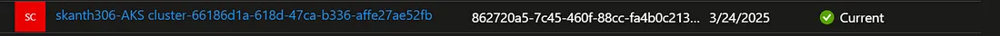

Click on the name, then go to “API Permissions” and click on “Add a Permission.”
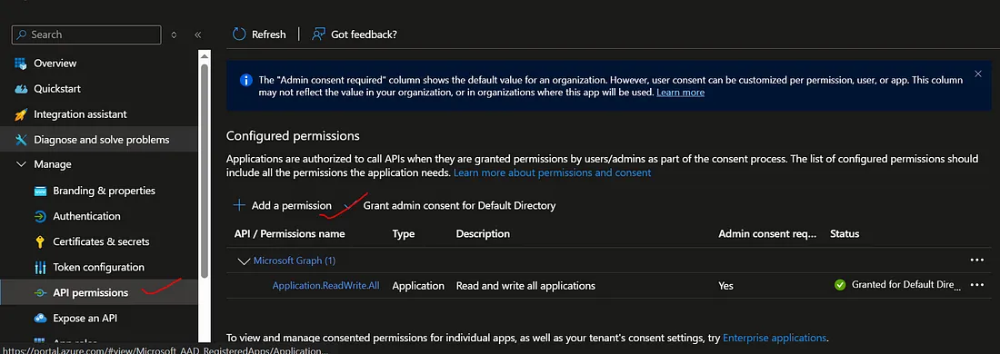

and then click on the microsoft graph
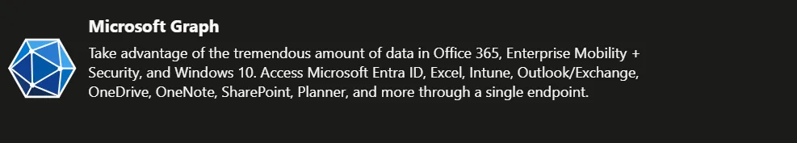

and select application permissions
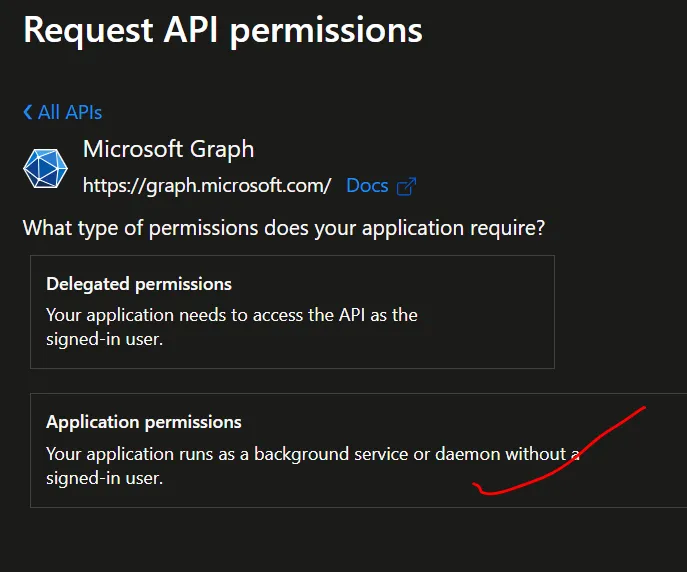

Now, search for the application by typing “Application,” and then assign the “Application.ReadWrite.All” permission.
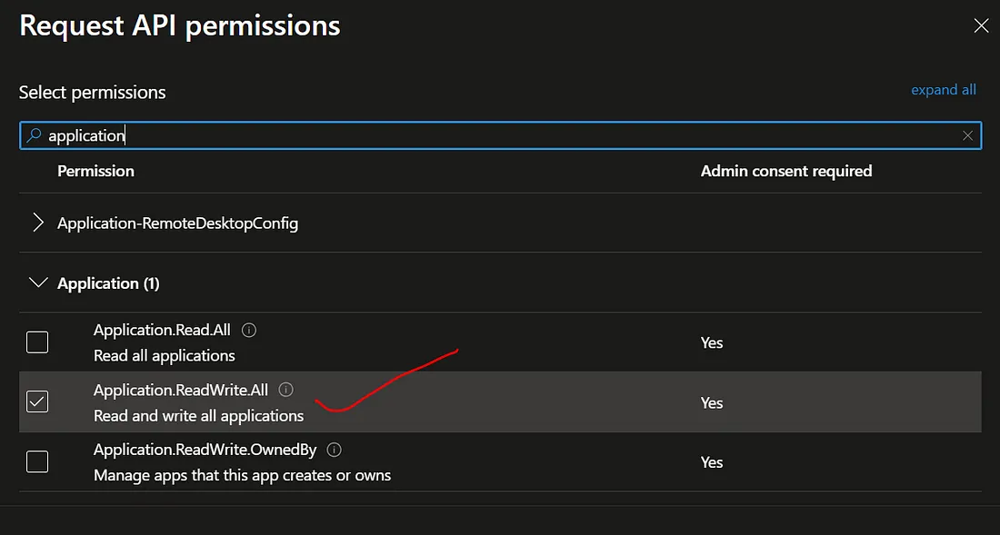

and then click on “Grant admin consent for Default Directory”.
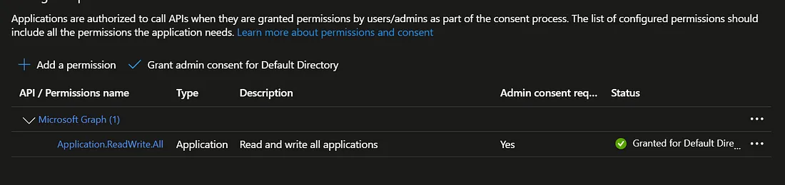

Next, assign a few permissions at the subscription level. Grant the “Key Vault Administrator” role and the “User Access Administrator” role to the service principal at the subscription level.
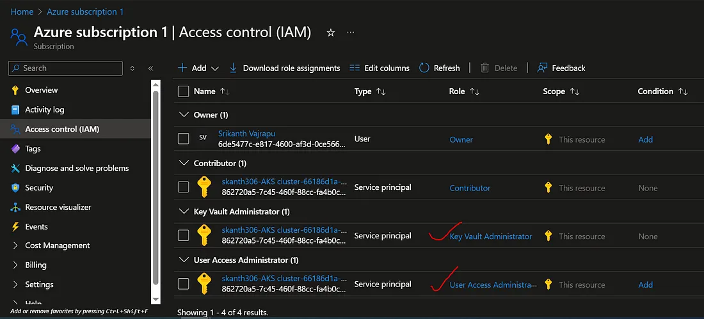

All set, Now run the pipeline.

Run demo applications
To see the ingress controller in action, run two demo applications in your AKS cluster. In this example, you use kubectl apply to deploy two instances of a simple Hello world application.

Create an aks-helloworld-one.yaml file and copy in the following example YAML:

```
apiVersion: apps/v1
kind: Deployment
metadata:
  name: aks-helloworld-one  
spec:
  replicas: 1
  selector:
    matchLabels:
      app: aks-helloworld-one
  template:
    metadata:
      labels:
        app: aks-helloworld-one
    spec:
      containers:
      - name: aks-helloworld-one
        image: mcr.microsoft.com/azuredocs/aks-helloworld:v1
        ports:
        - containerPort: 80
        env:
        - name: TITLE
          value: "Welcome to Azure Kubernetes Service (AKS)"
---
apiVersion: v1
kind: Service
metadata:
  name: aks-helloworld-one  
spec:
  type: ClusterIP
  ports:
  - port: 80
  selector:
    app: aks-helloworld-one
```
2. Create an aks-helloworld-two.yaml file and copy in the following example YAML:
```
apiVersion: apps/v1
kind: Deployment
metadata:
  name: aks-helloworld-two  
spec:
  replicas: 1
  selector:
    matchLabels:
      app: aks-helloworld-two
  template:
    metadata:
      labels:
        app: aks-helloworld-two
    spec:
      containers:
      - name: aks-helloworld-two
        image: mcr.microsoft.com/azuredocs/aks-helloworld:v1
        ports:
        - containerPort: 80
        env:
        - name: TITLE
          value: "AKS Ingress Demo"
---
apiVersion: v1
kind: Service
metadata:
  name: aks-helloworld-two  
spec:
  type: ClusterIP
  ports:
  - port: 80
  selector:
    app: aks-helloworld-two
```
3. Run the two demo applications using kubectl apply
```
kubectl apply -f aks-helloworld-one.yaml
kubectl apply -f aks-helloworld-two.yaml
```
Create an ingress route
Both applications are now running on your Kubernetes cluster. To route traffic to each application, create a Kubernetes ingress resource. The ingress resource configures the rules that route traffic to one of the two applications.

In the following example, traffic to EXTERNAL_IP/hello-world-one is routed to the service named aks-helloworld-one. Traffic to EXTERNAL_IP/hello-world-two is routed to the aks-helloworld-two service. Traffic to EXTERNAL_IP/static is routed to the service named aks-helloworld-one for static assets.

Create a file named hello-world-ingress.yaml and copy in the following example YAML:
```
apiVersion: networking.k8s.io/v1
kind: Ingress
metadata:
  name: hello-world-ingress
  annotations:
    appgw.ingress.kubernetes.io/backend-path-prefix: "/"
spec:
  ingressClassName: azure-application-gateway
  rules:
  - http:
      paths:
      - path: /hello-world-one
        pathType: Prefix
        backend:
          service:
            name: aks-helloworld-one
            port:
              number: 80
      - path: /hello-world-two
        pathType: Prefix
        backend:
          service:
            name: aks-helloworld-two
            port:
              number: 80
      - path: /
        pathType: Prefix
        backend:
          service:
            name: aks-helloworld-one
            port:
              number: 80
---
apiVersion: networking.k8s.io/v1
kind: Ingress
metadata:
  name: hello-world-ingress-static
  annotations:
    appgw.ingress.kubernetes.io/backend-path-prefix: "/"
spec:
  ingressClassName: azure-application-gateway
  rules:
  - http:
      paths:
      - path: /static
        pathType: Prefix
        backend:
          service:
            name: aks-helloworld-one
            port: 
              number: 80
```
2. Create the ingress resource using the kubectl apply command.
```
kubectl apply -f hello-world-ingress.yaml
```
Test the ingress controller
To test the routes for the ingress controller, browse to the two applications. Open a web browser to the IP address of your NGINX ingress controller, such as EXTERNAL_IP. The first demo application is displayed in the web browser, as shown in the following example:
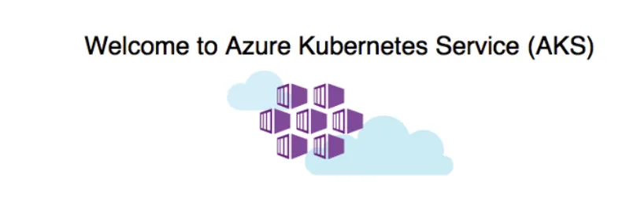

Now add the /hello-world-two path to the IP address, such as EXTERNAL_IP/hello-world-two. The second demo application with the custom title is displayed:


Clean up resources
This article used Helm to install the ingress components and sample apps.
Delete resources individually
Delete the individual resources created.

Remove the ingress route that directed traffic to the sample apps.
```
kubectl delete -f hello-world-ingress.yaml
```
Remove the two sample applications.
```
kubectl delete -f aks-helloworld-one.yaml
kubectl delete -f aks-helloworld-two.yaml
```
Now you can destroy the entite infrastructure by running the tf_destroy.yaml
🗑️ tf_destroy.yml
This pipeline can be manually triggered to clean up the entire AKS + AGIC setup:
```
trigger: none

pool:
  vmImage: ubuntu-latest

stages:
- stage: terraformdestroy
  jobs:
  - job: terraformdestroy
    pool:
      vmImage: ubuntu-latest
    steps:
    - task: TerraformInstaller@1
      inputs:
        terraformVersion: 'latest'
    - task: TerraformTaskV4@4
      inputs:
        provider: 'azurerm'
        command: 'init'
        workingDirectory: '$(System.DefaultWorkingDirectory)/terraform-aks/'
        backendServiceArm: 'select your subscription here'
        backendAzureRmResourceGroupName: 'resource_group_name'
        backendAzureRmStorageAccountName: 'storage_account_name'
        backendAzureRmContainerName: 'container_name'
        backendAzureRmKey: 'key_name'
    - task: TerraformTaskV4@4
      inputs:
        provider: 'azurerm'
        command: 'destroy'
        workingDirectory: '$(System.DefaultWorkingDirectory)/terraform-aks/'
        commandOptions: '--auto-approve'
        environmentServiceNameAzureRM: 'select your subscription here'
```
🔐 Tip: Always protect your destroy pipelines using manual approvals or restricted access in production environments.
🧱 Challenges Faced During Implementation
During the development of this greenfield AGIC setup, I encountered a few important issues worth noting:

🔐 Service Principal Permission Issues: Initially, the service principal didn’t have adequate permissions (Contributor on the subscription and Network Contributor on the VNet). Ensure these roles are explicitly granted using azurerm_role_assignment.
🔐 Key Vault Access Problems: I had to enable RBAC on Key Vault and assign the correct roles to allow secret creation via Terraform.
📦 OCI Repository Conflicts: The Helm provider didn’t work well with an OCI registry when using AGIC. I reverted to using a public HTTPS-based Helm repo instead.
🛑 Incomplete armAuth.secretJSON: At first, I passed only basic fields like clientId, clientSecret, tenantId, and subscriptionId to AGIC. This caused failures. The fix was to include all Azure environment endpoint values, like resourceManagerEndpointUrl, galleryEndpointUrl, and others — as shown in the full locals block earlier.
📍 App Gateway Path-Based Routing Not Working: Another issue was with path-based routing in the Azure Application Gateway. Due to this annotation:
```
annotations:
  appgw.ingress.kubernetes.io/backend-path-prefix: "/"
```
Path-based routing worked correctly with this annotation. Without it, it didn’t work.

